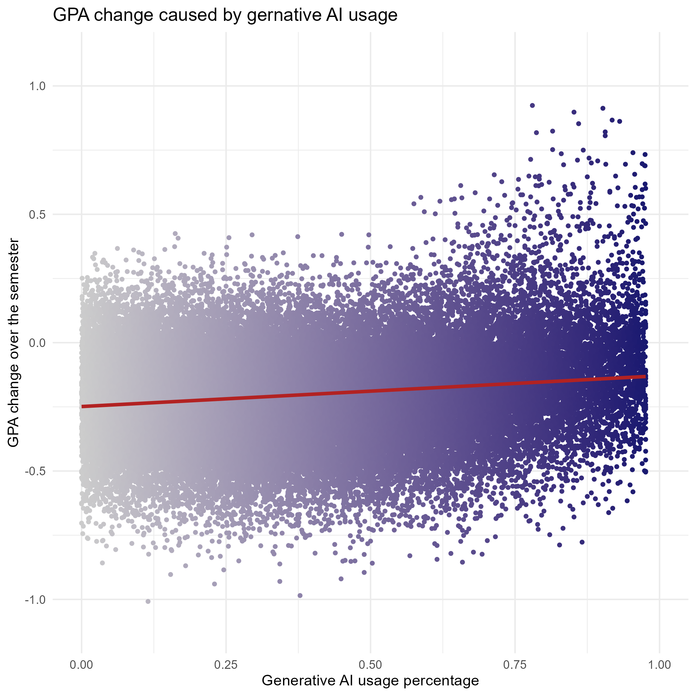
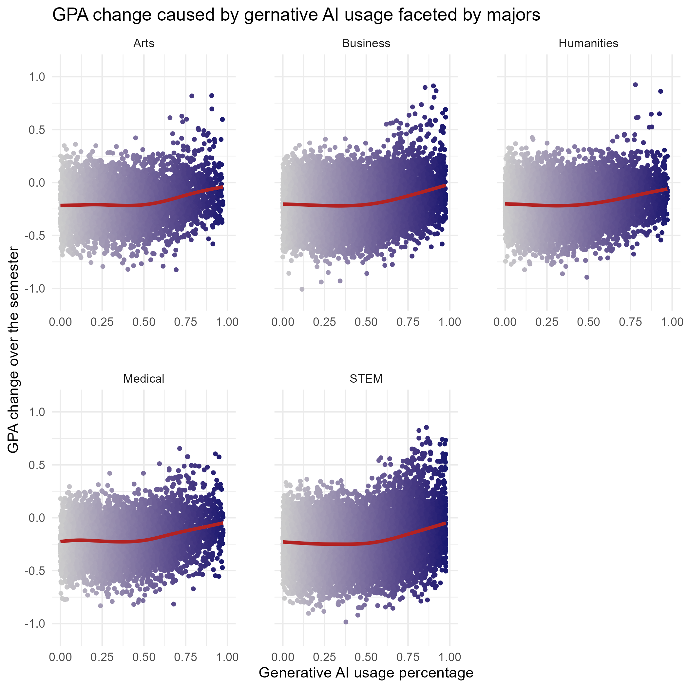

## Introduction

Now that I have been working on anwsering the 2 research questions with statistical methods, 
I'm ready to present you the final results of the analysis.

## Question 1: In which majors is the GPA most affected by heavier AI Usage?*

*Preparation*

Before we can draw plots we need analyse the question. 
This question consists of 3 dimensions:
- 1.: The majors
- 2.: The effect on the GPA
- 3.: The heaviness of AI usage

1.: The majors

The first point is self-explanatory, but the other two need some thinkering. 

2.: The effect on the GPA

To measure this we first need to define what the effect on the GPA is: 
The effect on the GPA is the change of the GPA over one semester. 

As we already have the data on pre and post semester GPA, the GPA change is calculated as followed:  
GPA_Change_Over_Semester = Post_Semester_GPA - Pre_Semester_GPA  

3.: The heaviness of AI usage

We have many different columns in the dataset which could be used to model this question, 
like the tool diversity or using a paid subsription, but I think following definition is enough:  
The heaviness of AI usage is the precentage of time learning with the help of AI opposed to 
the percentage of traditional study hours.

This can be calculated as followed:  
Percentage_Of_AI_Usage = Weekly_GenAI_Hours / (Traditional_Study_Hours + Weekly_GenAI_Hours)

*Plotting*

Now that we have all the data needed for anwsering the question we can plot it. 
At first I am interested on the GPA affected by the heaviness of Ai usage without 
looking at the majors to see the general trend.  
We can map the heaviness of AI usage to the x-axis and the GPA change on the y-axis. 
Going through each student of the dataset and visualize them in this plot via a point 
geom does the job. To better see the trend we can also use a smooth geom as this gives us a trend line.

Now we can alos facet the data into the majors which gives us a third dimensions. 
To avoid a convoluted 3D plot we instead use facetting to divide the majors into 2-dimensional plots.

